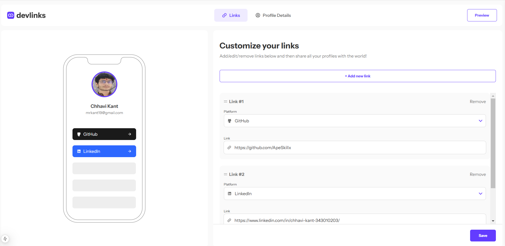
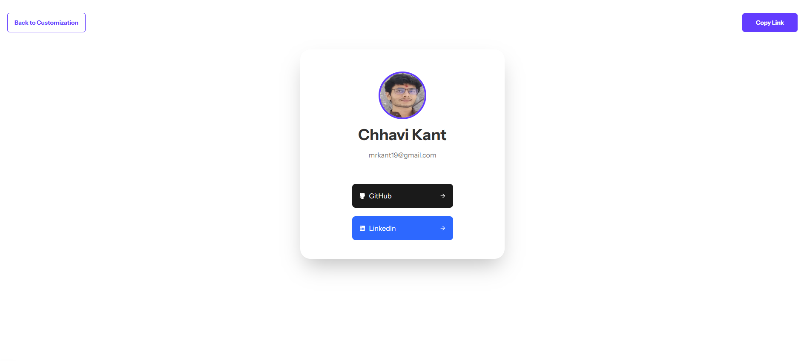

# DEVLINKS

## Overview

DEVLINKS is a full-stack application that allows users to create, read, update, and delete links while providing previews of those links in a mobile mockup. The app also supports profile management, including the ability to upload a profile picture and input personal details. Additionally, it features drag-and-drop functionality for reordering links and thorough validation for user inputs.

**Dashboard**

**Profile**

**Preview**


## Technologies Used

- **Frontend:**
  - **Next.js**: A React framework for building server-side rendered applications.
  - **React**: A JavaScript library for building user interfaces.
  - **Tailwind CSS**: A utility-first CSS framework for styling.
  - **@dnd-kit**: A set of React utilities for building drag-and-drop interfaces.
  - **Axios**: A promise-based HTTP client for making requests to the backend.
  - **React Hot Toast**: For displaying notifications.

- **Backend:**
  - **Node.js**: JavaScript runtime for building server-side applications.
  - **Express.js**: A web framework for Node.js.
  - **MongoDB**: A NoSQL database for storing user data and links.
  - **Mongoose**: An ODM (Object Data Modeling) library for MongoDB and Node.js.
  - **Cloudinary**: For storing and managing user-uploaded images.

## Instructions to Run the Project Locally

### Prerequisites

1. **MongoDB**: Set up a MongoDB database. You can use MongoDB Atlas for a cloud solution or run MongoDB locally.

2. **Cloudinary Account**: Create an account on Cloudinary for image uploads.

### Getting Started

1. **Clone the Repository**
```
   git clone https://github.com/ApeSkillx/Devlinks.git
   cd devlinks
```
2. **Install Dependencies**
```
    npm install
```
3. **Set Up Environment Variables**
```
Create .env.local file in root
Take refrence from .env.sample file
```
4. **Run the Development Server**
```
    npm run dev
```
5. **Access the Application**
```
Open your browser and navigate to http://localhost:3000
```
## Features

- **Create, Read, Update, Delete Links**: Manage your links effectively.
- **Form Validation**: Ensure that URLs are valid and required fields are filled out.
- **Drag and Drop**: Easily reorder links using drag-and-drop functionality.
- **Profile Management**: Add and update personal details, including profile picture.
- **Responsive Design**: The interface adjusts according to the screen size.
- **Hover and Focus States**: Interactive elements have defined hover and focus states.

## Bonus Features

- **Database Integration**: User details and links are stored in a MongoDB database.
- **Coming Soon**:
***User Authentication***: Multiple user Acounts logins.
